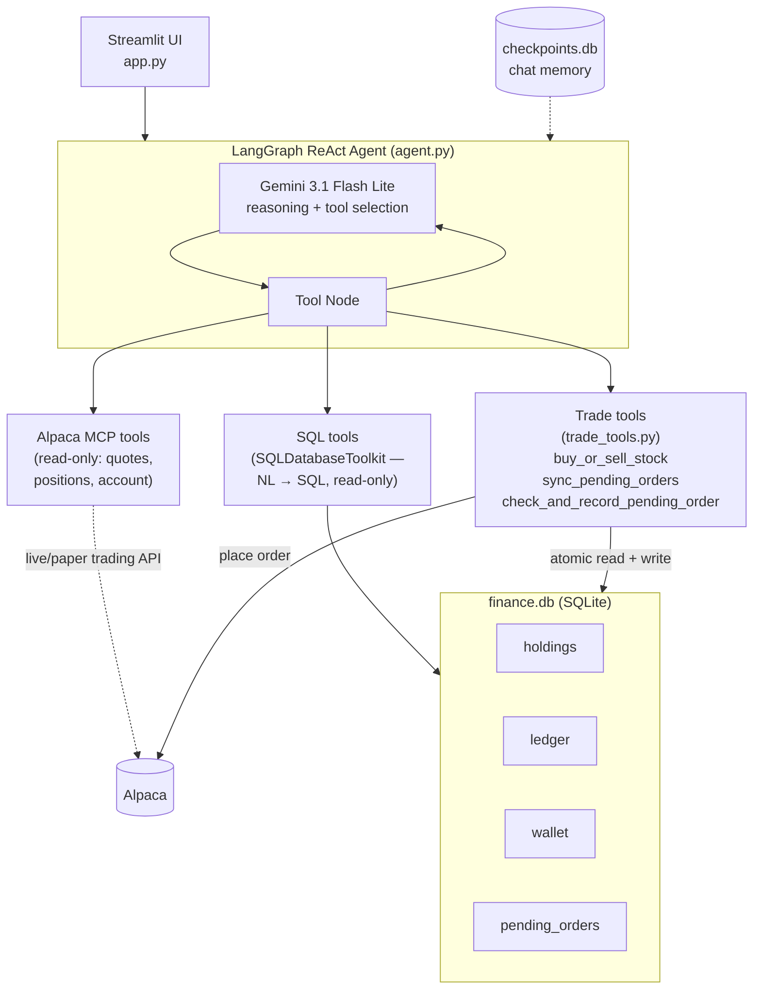

# 📈 Smart Finance Agent

An AI financial agent that trades real (paper) stocks through Alpaca, answers questions about your financial data via natural language SQL, and keeps a local, price-accurate record of your cash balance, holdings, and trade history — all through a conversational Streamlit interface powered by LangGraph and Google Gemini.

## Features

- **Conversational trading** — place market buy/sell orders for stocks by chatting with the agent, backed by [Alpaca's official MCP server](https://docs.alpaca.markets/us/docs/alpaca-mcp-server)
- **Local wallet, holdings & ledger** — every trade updates a local SQLite-backed cash balance, position tracker, and append-only transaction log, independent of Alpaca's own account state
- **Market-closed safe** — orders placed while markets are closed are queued and only recorded locally once they actually fill, using the real fill price (not a guessed one)
- **Natural-language SQL queries** — ask things like *"what's my AAPL position worth"* or *"show my last 5 transactions"*, answered via LangChain's `SQLDatabaseToolkit`
- **Persistent chat memory** — conversations survive app restarts via a SQLite-backed LangGraph checkpointer, with a one-click "delete chat history" option
- **Gemini-compatible tool calling** — MCP tool schemas are sanitized for compatibility with `ChatGoogleGenerativeAI`'s function-calling format

## Architecture



### Why trades don't go straight to the LLM

Raw order-placement tools (`place_stock_order`, etc.) are **excluded** from what's bound to the LLM. Instead, a single Python-level tool (`buy_or_sell_stock`) wraps the Alpaca call *and* the local database update as one atomic operation. This avoids relying on the model to correctly chain two separate tool calls in the right order with the right (real, filled) price — which is especially unsafe for anything touching money.

## Tech Stack

| Layer | Tool |
|---|---|
| Agent orchestration | [LangGraph](https://langchain-ai.github.io/langgraph/) (`StateGraph`, `ToolNode`, `tools_condition`) |
| LLM | Google Gemini (`gemini-3.1-flash-lite` via `langchain-google-genai`) |
| Trading | [Alpaca MCP Server](https://github.com/alpacahq/alpaca-mcp-server) via `langchain-mcp-adapters` |
| SQL access | `SQLDatabaseToolkit` (LangChain) |
| Frontend | Streamlit |
| Persistence | SQLite (`finance.db` for financial data, `checkpoints.db` for chat memory) |

## Setup

### Prerequisites

- Python 3.10+
- [`uv`](https://docs.astral.sh/uv/getting-started/installation/) (for `uvx`, used to run the Alpaca MCP server)
- Alpaca paper trading account ([free signup](https://app.alpaca.markets/paper/dashboard/overview))
- Google API key with Gemini access

### Installation

```bash
git clone https://github.com/aniketK96k/smart-finance-agent.git
cd smart-finance-agent
pip install -r requirements.txt
```

### Environment variables

Create a `.env` file in the project root:

```env
GOOGLE_API_KEY=your_google_api_key
AlpacaKey=your_alpaca_api_key
AlpacaSecret=your_alpaca_secret_key
```

### Initialize the database

```bash
python setup_trading_tables.py
```

This creates `holdings`, `ledger`, `wallet`, and `pending_orders` tables in `data/finance.db`. Safe to re-run — it won't overwrite existing data.

Seed your wallet with a starting balance (adjust as needed):

```bash
python -c "
import sqlite3
conn = sqlite3.connect('data/finance.db')
conn.execute('UPDATE wallet SET balance = ? WHERE id = 1', (100000,))
conn.commit()
conn.close()
"
```

### Run

```bash
streamlit run app.py
```

## Usage

Ask things like:

- *"Buy 10 shares of AAPL"*
- *"What's my current wallet balance?"*
- *"Show me my holdings"*
- *"Sync my pending orders"* — reconciles any trades placed while markets were closed
- *"What's my portfolio's total invested value?"*

## Project Structure

```
smart-finance-agent/
├── agent.py                    # LangGraph agent, tool binding, chat/memory functions
├── app.py                      # Streamlit UI
├── trade_tools.py              # buy_or_sell_stock, sync_pending_orders, reconciliation
├── setup_trading_tables.py     # DB schema initialization (holdings/ledger/wallet/pending_orders)
├── mcpC/
│   └── mcpclient.py            # Alpaca MCP client configuration
├── sanitizerGemini/
│   └── gemini_schema_patch.py  # MCP tool schema fixes for Gemini compatibility
├── sql/
│   └── sqlDB.py                # SQLDatabaseToolkit setup
├── data/
│   └── finance.db              # Local financial data (gitignored)
├── checkpoints.db              # Chat history (gitignored)
└── requirements.txt
```

## Known Limitations

- Market orders placed outside trading hours are queued locally but require an explicit "sync" request (in chat) to reconcile — there's no background scheduler yet
- Single-user design — `wallet`/`holdings` are global, not per-user
- Paper trading only by default (set `ALPACA_PAPER_TRADE=false` in the Alpaca MCP config for live trading — use with caution)

## Disclaimer

This project is for educational purposes. It is not financial advice. Trades are placed against Alpaca's paper trading environment by default; enabling live trading is done at your own risk.
